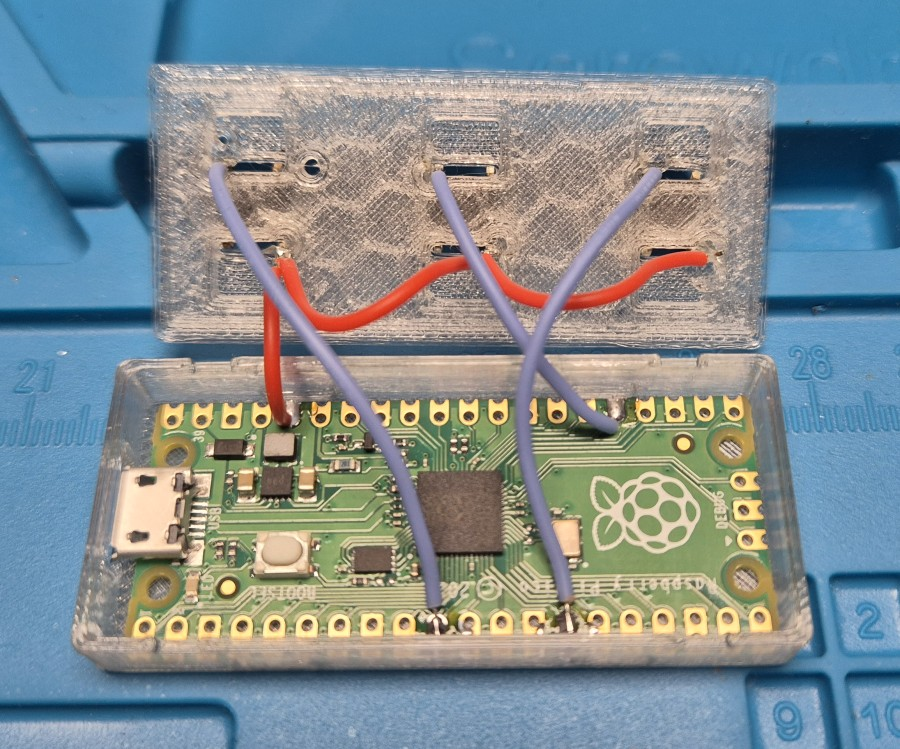

# circuit-pico-keyboard
This is a very minimal project to use a Raspberry Pi Pico (w) as a USB keyboard to choose the boot OS in grub. It has three buttons which emulate Up arrow, Enter and Down arrow.

## Install
1) Install [CircuitPython](https://circuitpython.org/downloads) by downloading the version for your board. Press the Bootsel button while plugging it into your computer and copy the `.u2f` file to it. It will reboot automatically once the file is uploaded.
1) Download the [Adafruit_CircuitPython_HID](https://github.com/adafruit/Adafruit_CircuitPython_HID/releases/) lib corresponding to the CircuitPython version. I.e. `CircuitPython 9.1.4` = `adafruit-circuitpython-hid-9.x-mpy-6.1.2.zip` and extract the `adafruit_hid` folder into the `lib` folder on the pico.
1) Copy `boot.py` and `code.py` into the root directory of the pico.

## Notes
* If you want to access the files again after uploading this code, you have to press the middle/enter button while plugging it in.
* There is no real debouncing and the repeat of the buttons is pretty fast ... don't use is as a normal keyboard. :D
* If you want to wipe/factory reset the pico, you have to press the Bootsel button and upload the `flash_nuke.uf2` file which you can find by searching the internet. Ensure to use the version corresponding to your used board.
* Tested with

## Wiring

The buttons are connected to 3.3V with the red wire; the blue wires are then connecting them to the reading pins.

## 3D printed case
The case can be downloaded from my [printables.com library](https://www.printables.com/model/1019592-raspberry-pi-pico-case-with-3-buttons).
